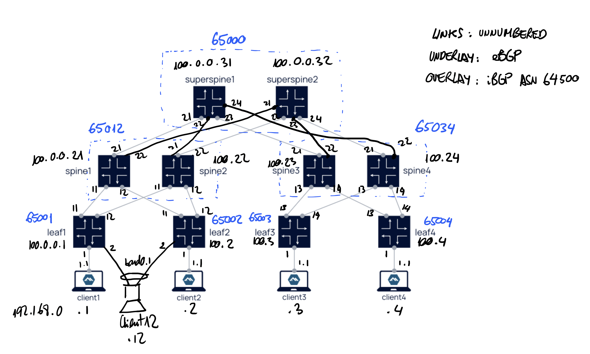

# 5-stage CLOS design inspired on RFC7938
This lab illustrates the RFC7938 large scale DC design, which consists of a leaf-spine and superspine topology, using eBGP in the underlay with dynamic neighbors and iBGP in the overlay for an EVPN ELAN service.

The following pic shows the setup.

